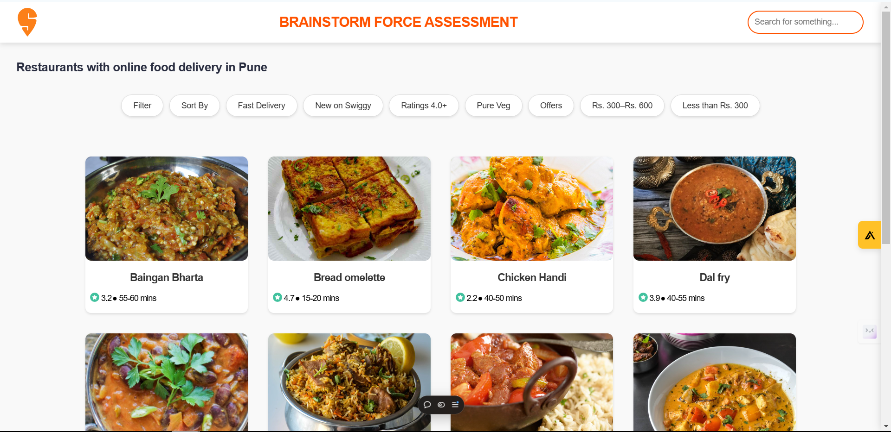
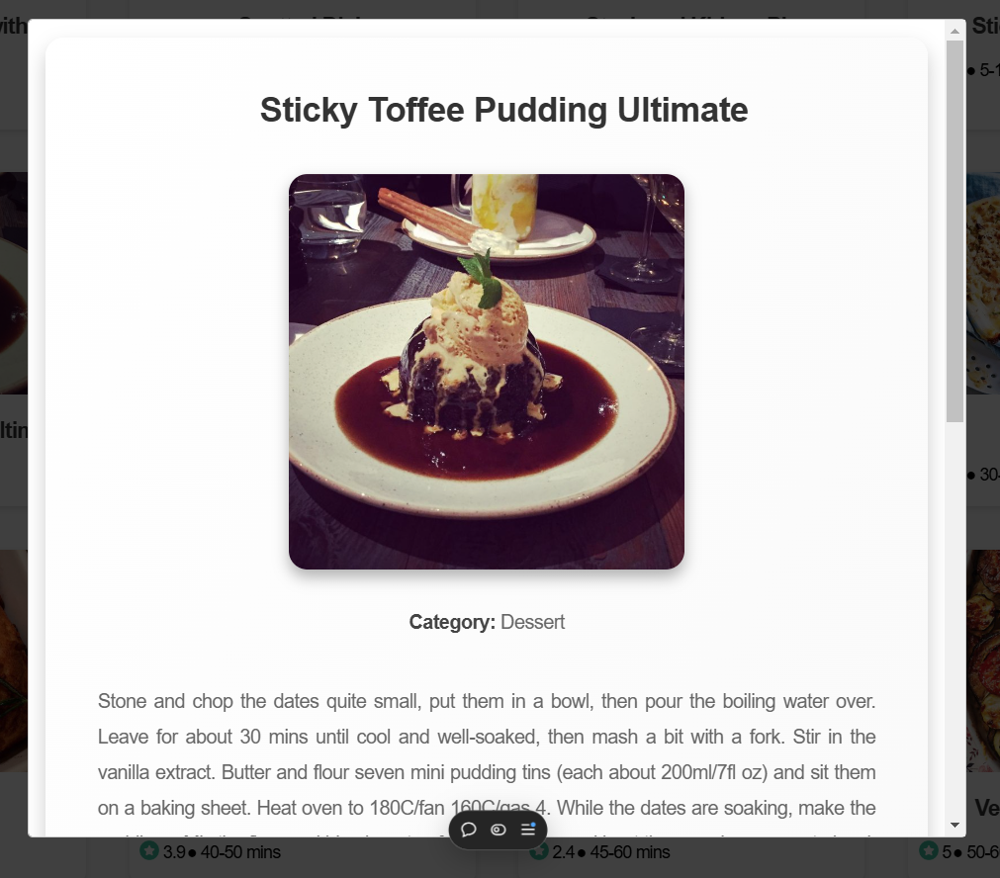

# Food Menu App

A responsive web application that showcases a variety of meals, allowing users to filter and sort meal options by different criteria. Users can view detailed information about meals through a modal and explore meals from different cuisines.

## 🚀 Live Demo  
Explore the app here: [Food Menu App](https://food-menu-app-nu.vercel.app/)

---

## 📝 Features

- **Filter Meals by Area**: View meals from different cuisines.
- **Sort Meals**: Alphabetically sort meals in ascending or descending order.
- **Detailed Meal Information**: Click on a meal card to see detailed instructions, category, and images.
- **Responsive Design**: Optimized for desktop and mobile devices.

---

## 📸 Screenshots  

### Home Page
- A list of meals with filtering and sorting options.


### Meal Modal
- Detailed information about a selected meal, including category, instructions, and image.


---

## 🛠️ Technologies Used  

- **Frontend**:  
  - React
  - Axios
  - PropTypes
  - CSS for styling
  - Modal for popups

- **API**:  
  - [TheMealDB API](https://www.themealdb.com/api.php)

- **Deployment**:  
  - [Vercel](https://vercel.com/)

---

## 📦 Installation & Setup  

1. Clone the repository:  
   ```bash
   git clone https://github.com/AvadhootT/Food-Menu-App.git

## 📦 Installation & Setup  

2. Navigate to the project folder:  
   ```bash
   cd food-menu-app

3. Install dependencies:  
   ```bash
   npm install
4. Start the development server:  
   ```bash
   npm run dev
5. Open your browser and navigate to:  
   ```bash
   http://localhost:5173
